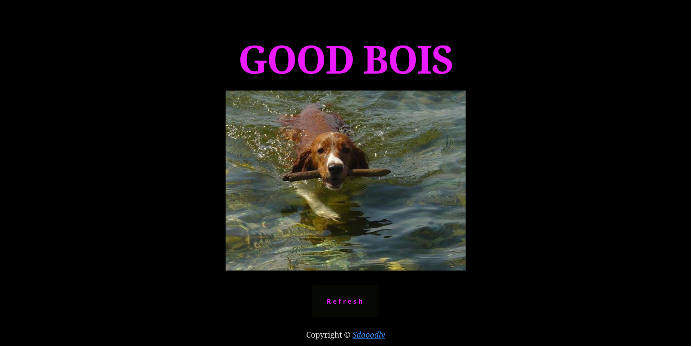

# good-bois

A website to fetch random dog images and practise calling APIs 

Live preview: https://sdooodly.github.io/good-bois/



## Features

- Loading state
- Blur up placeholder
- Breed label: extracts and displays a breed name from the image URL as a caption.
- Error UI: friendly error message with a retry button when fetch or load fails.
- History & Favorites: recent images are saved to `localStorage` (history) and you can save favorites to revisit later.
- Share & Download: Web Share API (fallback to clipboard) and a download anchor for the current image.
- Responsive polish: breakpoints and touch-friendly controls for mobile screens.
- Performance: images use `loading="lazy"`, a fetch timeout is applied, and a small placeholder improves perceived performance.
- Accessibility: improved `alt` text, aria-live caption updates, and keyboard-accessible controls.

## Controls & UI

- Refresh: fetch a new random dog image.
- ❤ Favorite: save/remove the current image to/from Favorites (persisted to `localStorage`).
- 🔗 Share: open native share dialog or copy URL to clipboard as fallback.
- ⬇ Download: download the current image as a JPEG.
- History & Favorites thumbnails: click a thumbnail to re-open that image.

## Run locally

Start a simple HTTP server from the project root and open the site in your browser:

```bash
python3 -m http.server 8000
# open http://localhost:8000
```

## Dev notes

- Main files:
	- `index.html` — markup and UI placeholders
	- `styles.css` — layout, spinner, placeholder and responsive styles
	- `script.js` — image loader, placeholder generation, history/favorites, share/download and error handling
- The app generates a tiny blurred placeholder at runtime from the fetched image blob for a smooth "blur-up" effect.
- History and favorites are saved under `goodbois_history_v1` and `goodbois_favs_v1` in `localStorage`.

## Testing & debugging

- Use browser devtools to simulate slow/offline networks and verify the error UI and placeholder behavior.
- The Web Share API is available only on secure contexts (HTTPS) and supported platforms — a clipboard fallback is provided.

## Credits

- API: https://dog.ceo/api/breeds/image/random
- H1 styling inspiration: https://codepen.io/DuskoStamenic/pen/QWaoBPY
- Button styling inspiration: https://codepen.io/HighFlyer/pen/WNXRZBv

